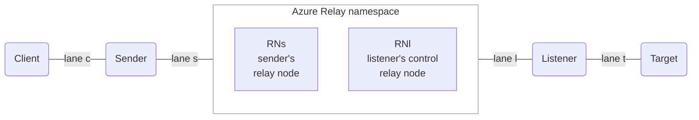
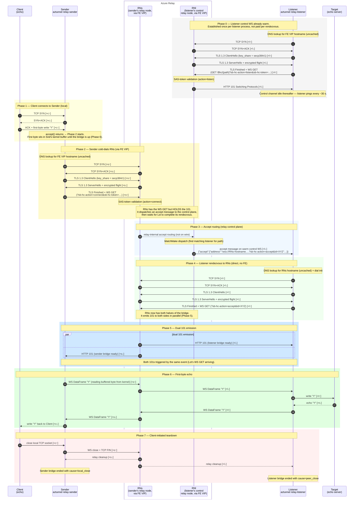

# Port-forward rendezvous

Wire-level sequence for a single port-forward rendezvous from cold
state:

1. The Listener opens a control WebSocket to the Relay
   (`action=listen`) and waits.
2. A Client opens a TCP connection to the local Sender.
3. The Sender opens a fresh rendezvous WebSocket to Azure Relay.
4. The Listener picks up the accept message and dials back.
5. The Relay emits 101 to both halves in parallel.
6. The first byte echoes through the established bridge.
7. The connection tears down when the Client closes.

## Topology

Two relay nodes inside the namespace serve this rendezvous: `RNl`
holds the listener's warm control channel; `RNs` is the node the
sender dialled and is where the rendezvous itself happens. The
hop from `RNl` to `RNs` is relay-internal — invisible to clients
and modelled as zero cost. Lane `l` covers both the control
channel (Listener ↔ `RNl`, via FE VIP) and the listener's
rendezvous dial (Listener → `RNs` direct, hostname comes in the
accept message); the two sub-paths have similar RTTs from any
given host and are treated as one lane in the algebra.

## Sequence

## Critical-path hop counts

| Segment                                            | Lives in  | Hops on critical path     |
| -------------------------------------------------- | --------- | ------------------------- |
| Client TCP open + first-byte write (loopback, ≈ 0) | `c`       | 3 c                       |
| **Sender cold dial, WS GET arrives at RNs**        | `s`       | **5 s**                   |
| Accept message to listener                         | `l`       | 1 l                       |
| **Listener rendezvous, WS GET arrives at RNs**     | `l`       | **5 l**                   |
| RNs → Snd 101 (parallel with RNs → Lst 101)        | `s`       | 1 s                       |
| **Client open → Sender has 101**                   | `c,s,l`   | **3 c + 6 s + 6 l**       |
| First-byte echo through the bridge back to Client  | `c,s,l,t` | 1 c + 2 s + 2 l + 2 t     |
| **Client open → first byte echoed at Client**      | `c,s,l,t` | **4 c + 8 s + 8 l + 2 t** |

(Each TLS 1.3 handshake is 1 RTT — secp384r1 in the initial
`key_share` lets Azure Relay skip the HelloRetryRequest. The 5
sender-side hops in Phase 2 are SYN↑, SYN+ACK↓, ClientHello↑,
ServerHello↓, Finished+WSGET↑. Phase 4 has the same shape on
lane `l`.)

The Client ↔ Sender hops on lane `c` are on the dependency chain
but are loopback in this topology, so each is ≈ 0 ms.

## Key facts

1. **TLS 1.3 handshake is 1 RTT** because aztunnel's TLS dialer
   forces `secp384r1` in the initial `key_share`
   (`internal/relay/client.go`). Azure Relay accepts secp384r1
   without a HelloRetryRequest. A vanilla Go TLS client offers
   X25519 first and pays an extra RTT.
2. **The two 101s in Phase 5 are parallel.** RNs writes both as
   soon as it has both halves of the bridge. Neither blocks the
   other.
3. **Listener rendezvous bypasses the FE VIP.** The accept
   message hands the listener a relay node hostname; the listener
   dials that hostname directly. This is why Phase 4 is "lane
   l, direct, no FE".
4. **Every fresh rendezvous pays a DNS lookup.** Go's stdlib
   `net.Resolver` has no built-in cache, so every handler entry
   (`handleListen`, `handleConnect`, `handleAccept`) pays a
   fresh A+AAAA resolution. `DelayProfile.DNSLookup` models
   this cost.
5. **Bridge forwarding is modelled as a pipelined delay.** Each
   WS message is stamped with `arriveBy = now + (S + L)` on the
   read side and forwarded after that deadline, with multiple
   messages allowed in flight at once. A single echo pays
   `2·(S+L)`; a stream of back-to-back messages pays roughly
   `(S+L)` to fill the pipe. Stop-and-wait would have penalised
   throughput-bound tests by `N·(S+L)`, which is not how real
   TCP behaves.

## Calibration in tests

`mockrelay`'s `DelayProfile` parameterises this diagram:

| Diagram element                            | DelayProfile field                             |
| ------------------------------------------ | ---------------------------------------------- |
| Lane `s` one-way (Phase 2, Phase 5 101)    | `SLatency`                                     |
| Lane `l` one-way (Phase 0, 3, 4, 5 101)    | `LLatency`                                     |
| Per-handler DNS lookup (Phase 0, 2, 4)     | `DNSLookup`                                    |
| SAS-token validation (Phase 0 and Phase 2) | `AuthInternal`                                 |
| Accept-message dispatch (Phase 3)          | `MatchMakeInternal`                            |
| Phase 6 bridge forwarding                  | `SLatency + LLatency` (pipelined, per message) |

Pass `mockrelay/server.DelayProfileDefault` via
`server.WithDelayProfile(...)` to make the mock pay wire-faithful
costs.
