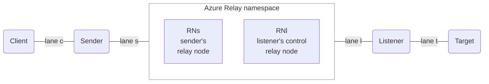
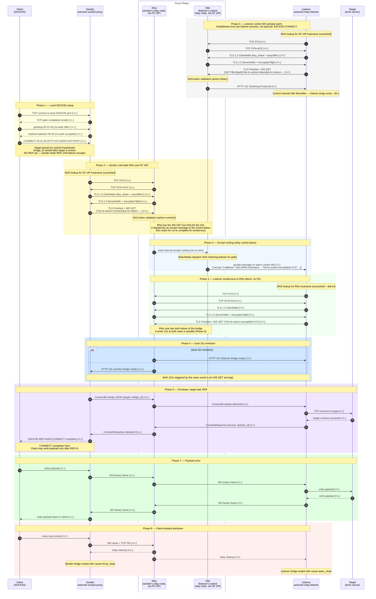

# SOCKS5 rendezvous

Wire-level sequence for a SOCKS5 rendezvous from cold state:

1. The Listener opens a control WebSocket to the Relay
   (`action=listen`) and waits.
2. A Client opens a TCP connection to the local SOCKS5 server
   (in-process on the Sender).
3. Client and Sender complete the SOCKS5 greeting and CONNECT.
4. The Sender performs the rendezvous with the Relay.
5. The Listener dials the target named in CONNECT.
6. The Listener's `ConnectResponse` returns through the bridge.
7. The Sender emits `REP=0x00` to the Client.
8. Payload flows in both directions until the Client closes.

## Topology

The Sender hosts an in-process SOCKS5 server, so the Client speaks
SOCKS5 on lane `c`. From the Relay's perspective the rendezvous is
identical to a port-forward — only the local protocol differs.
Inside the namespace, `RNl` holds the listener's warm control
channel and `RNs` is the node the sender dialled; the listener
also dials `RNs` directly (hostname comes in the accept message).
The relay-internal `RNs → RNl` hop is invisible and modelled as
zero cost.

## Sequence

## Critical-path hop counts

| Segment                                            | Lives in  | Hops on critical path     |
| -------------------------------------------------- | --------- | ------------------------- |
| Local TCP open before SOCKS5                       | `c`       | 2 c                       |
| SOCKS5 greeting (offer + selection)                | `c`       | 2 c                       |
| CONNECT request                                    | `c`       | 1 c                       |
| **Relay rendezvous, Snd SYN → Snd 101**            | `s,l`     | **6 s + 6 l**             |
| Envelope to listener (ConnectEnvelope outbound)    | `s,l`     | s + l                     |
| Target dial                                        | `t`       | 2 t                       |
| ConnectResponse back to sender                     | `s,l`     | s + l                     |
| REP to client                                      | `c`       | 1 c                       |
| **Cold start → REP visible to client**             | `c,s,l,t` | **6 c + 8 s + 8 l + 2 t** |
| Payload one-way through bridge                     | `c,s,l,t` | c + s + l + t             |
| **Payload echo (Client → Tgt → Client after REP)** | `c,s,l,t` | **2 c + 2 s + 2 l + 2 t** |

(`6 c` covers: TCP open `2 c` + greeting `2 c` + CONNECT `1 c` +
REP `1 c`. Loopback hops are ≈ 0 ms but are listed for
completeness.)

The Phase 6 `s + l + 2 t + s + l = 2 s + 2 l + 2 t` between
"Sender's 101 arrives" and "REP returns to the client" is the
ConnectEnvelope / target-dial / ConnectResponse round-trip on the
freshly-built bridge — this is the SOCKS5-specific cost on top of
the rendezvous.

## Key facts

1. **TLS 1.3 handshake is 1 RTT** because aztunnel's TLS dialer
   forces `secp384r1` in the initial `key_share`
   (`internal/relay/client.go`). Azure Relay accepts secp384r1
   without a HelloRetryRequest. A vanilla Go TLS client offers
   X25519 first and pays an extra RTT.
2. **The 30 s SOCKS5 handshake deadline is local-only.**
   `handleSOCKS5` sets a read deadline, runs `socks5.Handshake`,
   then clears it before relay work starts
   (`internal/sender/socks5proxy.go`). A slow client can stall
   only the local handshake window, not the bridge.
3. **Bridge ids start after CONNECT reveals the target.** The
   Sender mints the bridge id after `socks5.Handshake` returns
   the target, then binds it into the logger. The relay
   rendezvous and target dial both run under the same bridge id.
4. **No-auth and CONNECT-only.** `Handshake` accepts only method
   `0x00` and writes `0xFF` if no acceptable method is offered.
   Non-CONNECT commands return `REP=0x07`
   (`internal/sender/socks5/socks5.go`).
5. **Target failure surfaces as a non-zero REP.** If `Lst → Tgt`
   fails, the Listener replies with `ConnectResponse{ok:false}`
   and the Sender translates that to the appropriate SOCKS5 REP
   code (`internal/listener/listener.go`,
   `internal/sender/socks5proxy.go`).

## Calibration in tests

`mockrelay`'s `DelayProfile` parameterises the rendezvous phases:

| Diagram element                            | DelayProfile field                             |
| ------------------------------------------ | ---------------------------------------------- |
| Lane `s` one-way (Phase 2, Phase 5 101)    | `SLatency`                                     |
| Lane `l` one-way (Phase 0, 3, 4, 5 101)    | `LLatency`                                     |
| Per-handler DNS lookup (Phase 0, 2, 4)     | `DNSLookup`                                    |
| SAS-token validation (Phase 0 and Phase 2) | `AuthInternal`                                 |
| Entra-token validation (Phase 0, Phase 2)  | `EntraValidate`                                |
| Accept-message dispatch (Phase 3)          | `MatchMakeInternal`                            |
| Phase 6 and Phase 7 bridge forwarding      | `SLatency + LLatency` (pipelined, per message) |

The relay charges one token-validation cost per token-bearing leg,
selected by the inbound token's shape: `EntraValidate` for an Entra
(JWT) bearer token, `AuthInternal` for a SAS token.

Phase 6 (envelope / target dial / REP) and Phase 7 (payload) ride
the established bridge, which is delay-modelled as a pipelined
delay: each WS message pays one `S + L` end-to-end propagation,
with multiple messages allowed in flight at once. A single echo
pays `2·(S+L)`; a streaming download pays roughly one `S+L` to
fill the pipe — not N times that.
